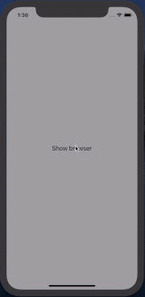

# MHWebViewController


[](https://travis-ci.org/michaelhenry/MHWebViewController) [](http://cocoapods.org/pods/MHWebViewController) [](http://cocoapods.org/pods/MHWebViewController) [](http://cocoapods.org/pods/MHWebViewController) <a href="https://developer.apple.com/swift"></a>



An Instagram inspired Web View Controller.

## How to Install

### Using Cocoapods, on your Podfile:
```ruby
target 'MyApp' do
  pod 'MHWebViewController', '~> 1.0'
end
```

## How to use

### Using URL
```swift
import MHWebViewController

present(url: URL(string: "https://iamkel.net")!, completion: nil)
```

### Using URLRequest
```swift
import MHWebViewController

present(urlRequest: URLRequest(url: URL(string: "https://iamkel.net")!), completion: nil)
```
